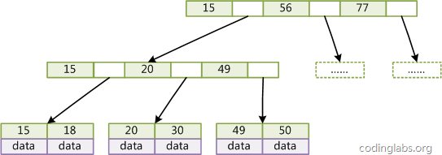

## 深入研究mysql数据库索引
[原文：MySQL索引背后的数据结构及算法原理](http://blog.codinglabs.org/articles/theory-of-mysql-index.html)
### 摘要
mysql数据库支持多种索引类型，如BTree索引、哈希索引、全文索引等

### 数据结构以及算法理论

#### 索引的本质
索引是帮助MySQL高效获取数据的数据结构。
* 查找算法以及时间复杂度
    * 线性查找 O(n)
    * 二分查找 O(nlog(n)) 要求被检索的数据有序
    * 二叉查找树 
    * B-Tree
    * B+ Tree
#### B-Tree 和 B+ Tree

* B-Tree

定义：二元组数据记录[key,data],key为记录的键，data为记录的值，对于不同的记录，key是不同的。data为数据记录除key以外的数据，那么B-Tree是满足以下条件的数据结构：
    * d 为大于1的整数，称为B-Tree的度。
    * h 为一个正整数，称为B-Tree的高度。
    * 每一个非叶子结点由你n-1个key和n个指针组成，其中 d<=n<=2d。
    * 每个叶子结点最少包含一个key和两个指针,最多包含2d-1个key和2d个指针，叶结点的指针均为NULL。
    * 所有的叶子结点具有相同的深度，等于树高h。
    * key和指针相互间隔，结点两端是指针。
    * 一个结点中的key从左至右非递减排列。
    * 所有结点组成树结构。
    * 每个指针要么为null要么纸箱另外一个结点。
    * 如果某个指针在结点node最左边，则其指向结点的所有key小于v(key1),其中v(key1)为node的第一个key值。
    * 如果某个指针在结点node最右边，则其指向结点的所有key大于v(key_m),其中v(key_m)为node的最后一个key值。
    * 如果某个指针在结点node的左右相邻key分别为key_i和key_i+1且不为null,则其指向结点的所有key值大于v(key_i)小鱼v(key_i+1)

下图是一个d=2的B-Tree示意图


下面是B-Tree进行查找的伪代码
```
    BTree_Search(node, key) {
        if(node == null) return null;
        foreach(node.key)
        {
            if(node.key[i] == key) return node.data[i];
                if(node.key[i] > key) return BTree_Search(point[i]->node);
        }
        return BTree_Search(point[i+1]->node);
    }
    data = BTree_Search(root, my_key);
```
关于B-Tree有一系列有趣的性质，例如一个度为d的B-Tree，设其索引N个key，则其树高h的上限为logd((N+1)/2)logd((N+1)/2)，检索一个key，其查找节点个数的渐进复杂度为O(logdN)O(logdN)。从这点可以看出，B-Tree是一个非常有效率的索引数据结构。
另外，由于插入删除新的数据记录会破坏B-Tree的性质，因此在插入删除时，需要对树进行一个分裂、合并、转移等操作以保持B-Tree性质，本文不打算完整讨论B-Tree这些内容，因为已经有许多资料详细说明了B-Tree的数学性质及插入删除算法，有兴趣的朋友可以在本文末的参考文献一栏找到相应的资料进行阅读。

* B+Tree
B-Tree有很多变种，其中最常见的就是B+Tree，mysql普遍使用B+Tree作为索引的数据结构，B+Tree有以下的特点：
    * 每个结点指针的上限为2d而不是2d+1
    * 内结点不存data,只存key,叶子结点不存储指针
   
下图是一个简单的B+Tree示意图


由于并不是所有节点都具有相同的域，因此B+Tree中叶节点和内节点一般大小不同。这点与B-Tree不同，虽然B-Tree中不同节点存放的key和指针可能数量不一致，但是每个节点的域和上限是一致的，所以在实现中B-Tree往往对每个节点申请同等大小的空间。
一般来说，B+Tree比B-Tree更适合实现外存储索引结构，具体原因与外存储器原理及计算机存取原理有关，将在下面讨论。

#### 使用B-Tree、B+Tree作为索引结构的原因
   * 索引也很大，不可能全部存储在内存中，往往需要以文件的形式存储在磁盘上。
   * b-Tree、B+Tree能有效的减少磁盘IO次数

### mysql 索引实现
* MyISAM 存储引擎（非聚簇类索引）
MyISAM数据文件与索引分离。
MyISAM 存储引擎索引原理图：


叶子结点的data域存储的是记录的地址

这里设表一共有三列，假设我们以Col1为主键，则图8是一个MyISAM表的主索引（Primary key）示意。可以看出MyISAM的索引文件仅仅保存数据记录的地址。在MyISAM中，主索引和辅助索引（Secondary key）在结构上没有任何区别，只是主索引要求key是唯一的，而辅助索引的key可以重复。

辅助索引原理图


注意：主索引要求key是唯一的，辅助索引不要求key是唯一的，其他的和主索引一样。

* InnoDB存储引擎（聚簇索引）

InnoDB数据文件本身就是按照B+Tree组织的一个索引结构，这棵树的叶子结点保存了完整的数据记录，这个索引的key是数据表的主键，因此InnoDB数据表本身就是主索引。


InnoDB辅助索引示意图


* MyISAM存储引擎与InnoDB存储引擎索引的区别
    * 因为InnoDB的数据文件本身要按主键聚集，所以InnoDB要求表必须有主键（MyISAM可以没有），如果没有显式指定，则MySQL系统会自动选择一个可以唯一标识数据记录的列作为主键，如果不存在这种列，则MySQL自动为InnoDB表生成一个隐含字段作为主键，这个字段长度为6个字节，类型为长整形。
    * InnoDB的辅助索引data域存储相应记录主键的值而不是地址。换句话说，InnoDB的所有辅助索引都引用主键作为data域。
* 索引优化原理
    * 聚集索引这种实现方式使得按主键的搜索十分高效，但是辅助索引搜索需要检索两遍索引：首先检索辅助索引获得主键，然后用主键到主索引中检索获得记录。
    * 知道了InnoDB的索引实现后，就很容易明白为什么不建议使用过长的字段作为主键，因为所有辅助索引都引用主索引，过长的主索引会令辅助索引变得过大。再例如，用非单调的字段作为主键在InnoDB中不是个好主意，因为InnoDB数据文件本身是一颗B+Tree，非单调的主键会造成在插入新记录时数据文件为了维持B+Tree的特性而频繁的分裂调整，十分低效，而使用自增字段作为主键则是一个很好的选择。

### mysql高性能使用索引策略
MySQL的优化主要分为结构优化（Scheme optimization）和查询优化（Query optimization）。本章讨论的高性能索引策略主要属于结构优化范畴。本章的内容完全基于上文的理论基础，实际上一旦理解了索引背后的机制，那么选择高性能的策略就变成了纯粹的推理，并且可以理解这些策略背后的逻辑。

#### 示例数据库
为了讨论索引策略，需要一个数据量不算小的数据库作为示例。本文选用MySQL官方文档中提供的示例数据库之一：employees。这个数据库关系复杂度适中，且数据量较大。下图是这个数据库的E-R关系图（引用自MySQL官方手册）


#### 最左前缀原理与相关优化
* 查看employees.titles存在的索引
```mysql
SHOW INDEX FROM employees.titles;
+--------+------------+----------+--------------+-------------+-----------+-------------+------+------------+
| Table  | Non_unique | Key_name | Seq_in_index | Column_name | Collation | Cardinality | Null | Index_type |
+--------+------------+----------+--------------+-------------+-----------+-------------+------+------------+
| titles |          0 | PRIMARY  |            1 | emp_no      | A         |        NULL |      | BTREE      |
| titles |          0 | PRIMARY  |            2 | title       | A         |        NULL |      | BTREE      |
| titles |          0 | PRIMARY  |            3 | from_date   | A         |      443308 |      | BTREE      |
| titles |          1 | emp_no   |            1 | emp_no      | A         |      443308 |      | BTREE      |
+--------+------------+----------+--------------+-------------+-----------+-------------+------+------------+
```
* 删除辅助索引emp_no
```mysql
ALTER TABLE employees.titles DROP INDEX emp_no;

##### 完全匹配
```
* 完全匹配
```mysql
EXPLAIN SELECT * FROM employees.titles WHERE emp_no='10001' AND title='Senior Engineer' AND from_date='1986-06-26';
+----+-------------+--------+-------+---------------+---------+---------+-------------------+------+-------+
| id | select_type | table  | type  | possible_keys | key     | key_len | ref               | rows | Extra |
+----+-------------+--------+-------+---------------+---------+---------+-------------------+------+-------+
|  1 | SIMPLE      | titles | const | PRIMARY       | PRIMARY | 59      | const,const,const |    1 |       |
+----+-------------+--------+-------+---------------+---------+---------+-------------------+------+-------+
```
* 完全匹配可以调整where查询条件的顺序
```mysql
EXPLAIN SELECT * FROM employees.titles WHERE emp_no='10001' AND title='Senior Engineer' AND from_date='1986-06-26';
+----+-------------+--------+-------+---------------+---------+---------+-------------------+------+-------+
| id | select_type | table  | type  | possible_keys | key     | key_len | ref               | rows | Extra |
+----+-------------+--------+-------+---------------+---------+---------+-------------------+------+-------+
|  1 | SIMPLE      | titles | const | PRIMARY       | PRIMARY | 59      | const,const,const |    1 |       |
+----+-------------+--------+-------+---------------+---------+---------+-------------------+------+-------+
```
##### 最左前缀匹配
```mysql
EXPLAIN SELECT * FROM employees.titles WHERE emp_no='10001';
+----+-------------+--------+------+---------------+---------+---------+-------+------+-------+
| id | select_type | table  | type | possible_keys | key     | key_len | ref   | rows | Extra |
+----+-------------+--------+------+---------------+---------+---------+-------+------+-------+
|  1 | SIMPLE      | titles | ref  | PRIMARY       | PRIMARY | 4       | const |    1 |       |
+----+-------------+--------+------+---------------+---------+---------+-------+------+-------+
```
当查询条件精确匹配索引的左边连续一个或几个列时，如<emp_no>或<emp_no, title>，所以可以被用到，但是只能用到一部分，即条件所组成的最左前缀。上面的查询从分析结果看用到了PRIMARY索引，但是key_len为4，说明只用到了索引的第一列前缀。
##### 查询条件用到了索引中列的精确匹配，但是中间某个条件未提供。
```mysql
EXPLAIN SELECT * FROM employees.titles WHERE emp_no='10001' AND from_date='1986-06-26';
+----+-------------+--------+------+---------------+---------+---------+-------+------+-------------+
| id | select_type | table  | type | possible_keys | key     | key_len | ref   | rows | Extra       |
+----+-------------+--------+------+---------------+---------+---------+-------+------+-------------+
|  1 | SIMPLE      | titles | ref  | PRIMARY       | PRIMARY | 4       | const |    1 | Using where |
+----+-------------+--------+------+---------------+---------+---------+-------+------+-------------+

```
此时索引使用情况和情况二相同，因为title未提供，所以查询只用到了索引的第一列，而后面的from_date虽然也在索引中，但是由于title不存在而无法和左前缀连接，因此需要对结果进行扫描过滤from_date（这里由于emp_no唯一，所以不存在扫描）。如果想让from_date也使用索引而不是where过滤，可以增加一个辅助索引<emp_no, from_date>，此时上面的查询会使用这个索引。除此之外，还可以使用一种称之为“
隔离列”的优化方法，将emp_no与from_date之间的“坑”填上。

* 首先我们看下title一共有几种不同的值：
```mysql
SELECT DISTINCT(title) FROM employees.titles;
+--------------------+
| title              |
+--------------------+
| Senior Engineer    |
| Staff              |
| Engineer           |
| Senior Staff       |
| Assistant Engineer |
| Technique Leader   |
| Manager            |
+--------------------+
```
只有7种。在这种成为“坑”的列值比较少的情况下，可以考虑用“IN”来填补这个“坑”从而形成最左前缀：
```mysql
EXPLAIN SELECT * FROM employees.titles
WHERE emp_no='10001'
AND title IN ('Senior Engineer', 'Staff', 'Engineer', 'Senior Staff', 'Assistant Engineer', 'Technique Leader', 'Manager')
AND from_date='1986-06-26';
+----+-------------+--------+-------+---------------+---------+---------+------+------+-------------+
| id | select_type | table  | type  | possible_keys | key     | key_len | ref  | rows | Extra       |
+----+-------------+--------+-------+---------------+---------+---------+------+------+-------------+
|  1 | SIMPLE      | titles | range | PRIMARY       | PRIMARY | 59      | NULL |    7 | Using where |
+----+-------------+--------+-------+---------------+---------+---------+------+------+-------------+
```
这次key_len为59，说明索引被用全了，但是从type和rows看出IN实际上执行了一个range查询，这里检查了7个key。
```mysql
SHOW PROFILES;
+----------+------------+-------------------------------------------------------------------------------+
| Query_ID | Duration   | Query                                                                         |
+----------+------------+-------------------------------------------------------------------------------+
|       10 | 0.00058000 | SELECT * FROM employees.titles WHERE emp_no='10001' AND from_date='1986-06-26'|
|       11 | 0.00052500 | SELECT * FROM employees.titles WHERE emp_no='10001' AND title IN ...          |
+----------+------------+-------------------------------------------------------------------------------+
```
“填坑”后性能提升了一点。如果经过emp_no筛选后余下很多数据，则后者性能优势会更加明显。当然，如果title的值很多，用填坑就不合适了，必须建立辅助索引。
##### 查询条件没有指定索引第一列
```mysql
EXPLAIN SELECT * FROM employees.titles WHERE from_date='1986-06-26';
+----+-------------+--------+------+---------------+------+---------+------+--------+-------------+
| id | select_type | table  | type | possible_keys | key  | key_len | ref  | rows   | Extra       |
+----+-------------+--------+------+---------------+------+---------+------+--------+-------------+
|  1 | SIMPLE      | titles | ALL  | NULL          | NULL | NULL    | NULL | 443308 | Using where |
+----+-------------+--------+------+---------------+------+---------+------+--------+-------------+
```
由于不是最左前缀，索引这样的查询显然用不到索引。

##### 匹配某列的前缀字符串
```mysql
EXPLAIN SELECT * FROM employees.titles WHERE emp_no='10001' AND title LIKE 'Senior%';
+----+-------------+--------+-------+---------------+---------+---------+------+------+-------------+
| id | select_type | table  | type  | possible_keys | key     | key_len | ref  | rows | Extra       |
+----+-------------+--------+-------+---------------+---------+---------+------+------+-------------+
|  1 | SIMPLE      | titles | range | PRIMARY       | PRIMARY | 56      | NULL |    1 | Using where |
+----+-------------+--------+-------+---------------+---------+---------+------+------+-------------+
```
如果通配符%不出现在开头，则可以用到索引，但根据具体情况不同可能只会用其中一个前缀
##### 范围查询
```mysql
EXPLAIN SELECT * FROM employees.titles WHERE emp_no < '10010' and title='Senior Engineer';
+----+-------------+--------+-------+---------------+---------+---------+------+------+-------------+
| id | select_type | table  | type  | possible_keys | key     | key_len | ref  | rows | Extra       |
+----+-------------+--------+-------+---------------+---------+---------+------+------+-------------+
|  1 | SIMPLE      | titles | range | PRIMARY       | PRIMARY | 4       | NULL |   16 | Using where |
+----+-------------+--------+-------+---------------+---------+---------+------+------+-------------+
```
范围列可以用到索引（必须是最左前缀），但是范围列后面的列无法用到索引。同时，索引最多用于一个范围列，因此如果查询条件中有两个范围列则无法全用到索引。
```mysql
EXPLAIN SELECT * FROM employees.titles
WHERE emp_no < '10010'
AND title='Senior Engineer'
AND from_date BETWEEN '1986-01-01' AND '1986-12-31';
```
+----+-------------+--------+-------+---------------+---------+---------+------+------+-------------+
| id | select_type | table  | type  | possible_keys | key     | key_len | ref  | rows | Extra       |
+----+-------------+--------+-------+---------------+---------+---------+------+------+-------------+
|  1 | SIMPLE      | titles | range | PRIMARY       | PRIMARY | 4       | NULL |   16 | Using where |
+----+-------------+--------+-------+---------------+---------+---------+------+------+-------------+
可以看到索引对第二个范围索引无能为力。这里特别要说明MySQL一个有意思的地方，那就是仅用explain可能无法区分范围索引和多值匹配，因为在type中这两者都显示为range。同时，用了“between”并不意味着就是范围查询，例如下面的查询：

```mysql
EXPLAIN SELECT * FROM employees.titles
WHERE emp_no BETWEEN '10001' AND '10010'
AND title='Senior Engineer'
AND from_date BETWEEN '1986-01-01' AND '1986-12-31';
+----+-------------+--------+-------+---------------+---------+---------+------+------+-------------+
| id | select_type | table  | type  | possible_keys | key     | key_len | ref  | rows | Extra       |
+----+-------------+--------+-------+---------------+---------+---------+------+------+-------------+
|  1 | SIMPLE      | titles | range | PRIMARY       | PRIMARY | 59      | NULL |   16 | Using where |
+----+-------------+--------+-------+---------------+---------+---------+------+------+-------------+
```
看起来是用了两个范围查询，但作用于emp_no上的“BETWEEN”实际上相当于“IN”，也就是说emp_no实际是多值精确匹配。可以看到这个查询用到了索引全部三个列。因此在MySQL中要谨慎地区分多值匹配和范围匹配，否则会对MySQL的行为产生困惑。
###### 查询条件中含有函数或表达式
很不幸，如果查询条件中含有函数或表达式，则MySQL不会为这列使用索引（虽然某些在数学意义上可以使用）。例如：
```mysql
EXPLAIN SELECT * FROM employees.titles WHERE emp_no='10001' AND left(title, 6)='Senior';
+----+-------------+--------+------+---------------+---------+---------+-------+------+-------------+
| id | select_type | table  | type | possible_keys | key     | key_len | ref   | rows | Extra       |
+----+-------------+--------+------+---------------+---------+---------+-------+------+-------------+
|  1 | SIMPLE      | titles | ref  | PRIMARY       | PRIMARY | 4       | const |    1 | Using where |
+----+-------------+--------+------+---------------+---------+---------+-------+------+-------------+
```
虽然这个查询和情况五中功能相同，但是由于使用了函数left，则无法为title列应用索引，而情况五中用LIKE则可以。再如：
```mysql
EXPLAIN SELECT * FROM employees.titles WHERE emp_no - 1='10000';
+----+-------------+--------+------+---------------+------+---------+------+--------+-------------+
| id | select_type | table  | type | possible_keys | key  | key_len | ref  | rows   | Extra       |
+----+-------------+--------+------+---------------+------+---------+------+--------+-------------+
|  1 | SIMPLE      | titles | ALL  | NULL          | NULL | NULL    | NULL | 443308 | Using where |
+----+-------------+--------+------+---------------+------+---------+------+--------+-------------+
```
显然这个查询等价于查询emp_no为10001的函数，但是由于查询条件是一个表达式，MySQL无法为其使用索引。看来MySQL还没有智能到自动优化常量表达式的程度，因此在写查询语句时尽量避免表达式出现在查询中，而是先手工私下代数运算，转换为无表达式的查询语句。

#### 索引选择性与前缀索引
索引文件本身要消耗存储空间，同时索引会加重插入、删除和修改记录时的负担，另外，MySQL在运行时也要消耗资源维护索引，因此索引并不是越多越好。一般两种情况下不建议建索引。
##### 表记录比较少，不要建索引
例如一两千条甚至只有几百条记录的表，没必要建索引，让查询做全表扫描就好了。至于多少条记录才算多，这个个人有个人的看法，我个人的经验是以2000作为分界线，记录数不超过 2000可以考虑不建索引，超过2000条可以酌情考虑索引。
##### 索引的选择性较低
所谓索引的选择性（Selectivity），是指不重复的索引值（也叫基数，Cardinality）与表记录数（#T）的比值：

Index Selectivity = Cardinality / #T

显然选择性的取值范围为(0, 1]，选择性越高的索引价值越大，这是由B+Tree的性质决定的。例如，上文用到的employees.titles表，如果title字段经常被单独查询，是否需要建索引，我们看一下它的选择性：
```mysql
SELECT count(DISTINCT(title))/count(*) AS Selectivity FROM employees.titles;
+-------------+
| Selectivity |
+-------------+
|      0.0000 |
+-------------+
```
title的选择性不足0.0001（精确值为0.00001579），所以实在没有什么必要为其单独建索引。
##### 前缀索引
有一种与索引选择性有关的索引优化策略叫做前缀索引，就是用列的前缀代替整个列作为索引key，当前缀长度合适时，可以做到既使得前缀索引的选择性接近全列索引，同时因为索引key变短而减少了索引文件的大小和维护开销。下面以employees.employees表为例介绍前缀索引的选择和使用。
```mysql
SHOW INDEX FROM employees.employees;
```
可以看到employees表只有一个索引<emp_no>，那么如果我们想按名字搜索一个人，就只能全表扫描了：
```mysql
EXPLAIN SELECT * FROM employees.employees WHERE first_name='Eric' AND last_name='Anido';
+----+-------------+-----------+------+---------------+------+---------+------+--------+-------------+
| id | select_type | table     | type | possible_keys | key  | key_len | ref  | rows   | Extra       |
+----+-------------+-----------+------+---------------+------+---------+------+--------+-------------+
|  1 | SIMPLE      | employees | ALL  | NULL          | NULL | NULL    | NULL | 300024 | Using where |
+----+-------------+-----------+------+---------------+------+---------+------+--------+-------------+
```
如果频繁按名字搜索员工，这样显然效率很低，因此我们可以考虑建索引。有两种选择，建<first_name>或<first_name, last_name>，看下两个索引的选择性：
```mysql
SELECT count(DISTINCT(first_name))/count(*) AS Selectivity FROM employees.employees;
+-------------+
| Selectivity |
+-------------+
|      0.0042 |
+-------------+
SELECT count(DISTINCT(concat(first_name, last_name)))/count(*) AS Selectivity FROM employees.employees;
+-------------+
| Selectivity |
+-------------+
|      0.9313 |
+-------------+
```
<first_name>显然选择性太低，<first_name, last_name>选择性很好，但是first_name和last_name加起来长度为30，有没有兼顾长度和选择性的办法？可以考虑用first_name和last_name的前几个字符建立索引，例如<first_name, left(last_name, 3)>，看看其选择性：
```mysql
SELECT count(DISTINCT(concat(first_name, left(last_name, 3))))/count(*) AS Selectivity FROM employees.employees;
+-------------+
| Selectivity |
+-------------+
|      0.7879 |
+-------------+
```
选择性还不错，但离0.9313还是有点距离，那么把last_name前缀加到4：
```mysql
SELECT count(DISTINCT(concat(first_name, left(last_name, 4))))/count(*) AS Selectivity FROM employees.employees;
+-------------+
| Selectivity |
+-------------+
|      0.9007 |
+-------------+
```
这时选择性已经很理想了，而这个索引的长度只有18，比<first_name, last_name>短了接近一半，我们把这个前缀索引 建上：

```mysql
ALTER TABLE employees.employees
ADD INDEX `first_name_last_name4` (first_name, last_name(4));
```

前缀索引兼顾索引大小和查询速度，但是其缺点是不能用于ORDER BY和GROUP BY操作，也不能用于Covering images.mysql.index（即当索引本身包含查询所需全部数据时，不再访问数据文件本身）。
```mysql
SHOW PROFILES;
+----------+------------+---------------------------------------------------------------------------------+
| Query_ID | Duration   | Query                                                                           |
+----------+------------+---------------------------------------------------------------------------------+
|       87 | 0.11941700 | SELECT * FROM employees.employees WHERE first_name='Eric' AND last_name='Anido' |
|       90 | 0.00092400 | SELECT * FROM employees.employees WHERE first_name='Eric' AND last_name='Anido' |
+----------+------------+---------------------------------------------------------------------------------+
```

#### InnoDB 主键选择与插入优化
在使用InnoDB存储引擎时，如果没有特别的需要，请永远使用一个与业务无关的自增字段作为主键。
