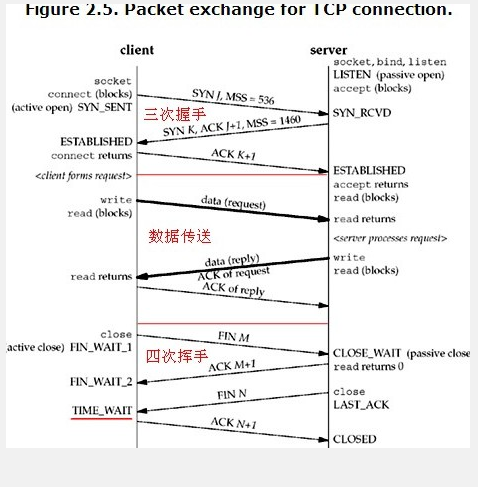

<!-- GFM-TOC -->
* [Unix网络编程源码编译以及开发环境搭建](##Unix网络编程源码编译以及开发环境搭建)
* [基本Socket程序](##基本Socket程序)
  * [客户端程序](###客户端程序)
  * [服务端程序](###服务端程序)
* [传输层协议实现细节](##传输层协议实现细节)
  * [用户访问网页背后发生了什么？](###用户访问网页背后发生了什么？)
* [进阶select实现](###进阶select实现)  

<!-- GFM-TOC -->
##Unix网络编程源码编译以及开发环境搭建
[ apue.3与unp在Linux上编程环境搭建](http://blog.csdn.net/weixin_35793200/article/details/79540155)

##基本Socket程序
###客户端程序
改程序取自Unix网络编程
```c
#include <unp.h>
#include <error.c>

int
main(int argc, char *argv[]) {
    int sockfd, n;
    // MAX_LIEN = 4096
    char recvline[MAXLINE + 1];
    struct sockaddr_in servaddr;

    if (argc != 2)
        err_quit("usage: a.out <IPaddress>");

    if ((sockfd = socket(AF_INET, SOCK_STREAM, 0)) < 0)
        err_sys("socket error");


    bzero(&servaddr, sizeof(servaddr));
    
    servaddr.sin_family = AF_INET;// 代表TCP类型的套接字
    
    servaddr.sin_port = htons(8080);    /* daytime server */
    
    if (inet_pton(AF_INET, argv[1], &servaddr.sin_addr) <= 0)
        err_quit("inet_pton error for %s", argv[1]);

    if (connect(sockfd, (SA *) &servaddr, sizeof(servaddr)) < 0)
        err_sys("connect error");

    while ((n = read(sockfd, recvline, MAXLINE)) > 0) {
        recvline[n] = 0;    /* null terminate */
        if (fputs(recvline, stdout) == EOF)
            err_sys("fputs error");
    }
    if (n < 0)
        err_sys("read error");

    exit(0);
}
```

### 服务端程序
```
#include	"unp.h"
#include	<time.h>

int
main(int argc, char **argv)
{
    int					listenfd, connfd;
    struct sockaddr_in	servaddr;
    char				buff[MAXLINE];
    time_t				ticks;

    listenfd = Socket(AF_INET, SOCK_STREAM, 0);

    bzero(&servaddr, sizeof(servaddr));
    servaddr.sin_family      = AF_INET;
    servaddr.sin_addr.s_addr = htonl(INADDR_ANY);
    servaddr.sin_port        = htons(8080);	/* daytime server */

    Bind(listenfd, (SA *) &servaddr, sizeof(servaddr));

    Listen(listenfd, LISTENQ);

    for ( ; ; ) {
        connfd = Accept(listenfd, (SA *) NULL, NULL);

        ticks = time(NULL);
        snprintf(buff, sizeof(buff), "%.24s\r\n", ctime(&ticks));
        Write(connfd, buff, strlen(buff));

        Close(connfd);
    }
}

```

## 传输层协议实现细节
### 用户访问网页背后发生了什么？
用户在浏览器中输入ip地址访问一个网页，然后服务器监测到访问之后会回传网页中的内容。在这样一个应用中，我们为简单起见假设服务器和客户端在一个以太网中，网络中传输的数据流的示意图如下

* 应用层------------------>浏览器发送服务请求
* 运输层------------------>TCP进行封装并传输给IP层
* 网络层---------------->IP拿到数据后，继续封装传给以太网驱动程序
* 网络层------------->以太网驱动程序将数据帧通过网卡等驱动程序传输到链路层
* 链路层、物理层------------->网络中的数据流
* 网络层<-------------服务端网卡等设备检测到链路上传输到自己网络的数据帧
* 网络层<----------------IP层进行解封装，将数据包发送到传输层
* 传输层<-----------------TCP解封装包，并传输给服务应用层
* 应用层<-----------------Web服务器应答返回请求数据
从用户应用进程的建立到数据的传输需要机器从用户态向内核态进行转化（或者是数据从应用层向运输层和网络层进行传输），而完成这个转化的桥梁就是我们socket提供的网络编程的API，通过网络编程可以完成上面的所有步骤，使得这个流程对用户来讲像是对等之间的传输而没有这种数据流向，并且API屏蔽了所有的这些细节，用户只需要几个函数就可以建立客户端到服务器之间的通信。
### 传输层协议
因为socket衔接的是应用层和传输层，所以为了编写健壮的客户服务器程序以及便于后面使用netstat等命令进行调试，熟悉传输层协议的细节是非常有必要的。Socket最长用的传输层协议是TCP，UDP，以及最新出现的SCTP，下面将分别进行介绍。
#### TCP协议
TCP协议(Transimmision Control Protocol)，即传输控制协议是一种复杂的，面向连接的，可靠的字节流协议。应用层协议中的：SMTP(邮件传输协议)，Telnet(远程登陆协议)，SSH(安全的远程登录)，FTP, HTTP, NNTP(网络新闻)，LPR(远程打印)等协议都是依靠TCP协议来完成。

* TCP 三次握手
  * 从上图中可以看到，服务器首先通过调用socket, bind 和 listen这三个函数进行监听，这里称为被动打开。这个时候我们可以查看(一)中server的代码，查看这三个函数的位置和用法。 之后，客户端如果想建立连接会调用socket以及connect函数(建议翻看上一节中客户端的代码)，这时候TCP会发送一个SYN码用于标识这个请求，同时会发送MSS(maximum segment size, 最大分节大小)码，MSS用来告诉服务器每次它能接受的最大的TCP流数据量，从而防止数据到了还要进行分片从组。这里稍微介绍一下MSS，MSS用16位进行表示，所以MSS的最大值为65535. MSS 一般取1460 为以太网MTU减去TCP和IP的首部20（即: 1460）。而这里的MSS取值536，也是一个特殊值，他是IPV4最小重组缓冲区字节数576-20-20；

  * 服务器在收到建立连接请求之后，会发送消息给客户端，这些消息内容包括：自己的SYN, 对于客户端的SYN的验证ACK=J+1，以及自己的MSS.

  * 客户端在收到服务器的消息并验证无误之后认为连接建立，成为 Established状态，并将服务器需要验证的字节码ACK发送过去，服务器收到之后也便建立了连接。

至此经过三次握手建立了连接，下面便开始数据传输。
* 为什么要三次握手 ？

* TCP数据传送
连接建立之后，客户端会调用read()函数，开启阻塞读模式，这时候TCP会将请求发送给服务器，服务器一般会先发送要求客户端进行验证的ACK但是有的时候会和应答的数据一起发送。

* TCP 四次挥手
如果一端需要断开连接，这里以客户端断开连接为例，他调用close()函数执行关闭状态，然后TCP会向服务器端发送FIN码进行验证，服务器端收到之后会发送验证ACK同时一段时间之后服务器端也会发送一个FIN码请求客户端进行验证。客户端在收到验证码之后处于TIME_WAIT状态，这是一个很重要的状态，可保证TCP传输的可靠性，后面我们将进行研究。同时客户端向服务器端发送ACK，服务器端收到验证无误之后便关闭整个流。

* 为什么要四次挥手？

* TCP的TIME_WAIT状态
TIME_WAIT状态到底是什么呢？ 在我看来他是TCP协议给关闭发起端设置的一个状态，这个状态持续的时间一般是2*MSL,（这个MSL称为最长分节生命期），在这个状态中，如果关闭请求的任何一个环节出现超时，有可能是由于链路状态造成的，那么为了顺利的关闭连接，TIME_WAIT的存在是很重要的。
    * “可靠的实现TCP全双工连级的终止”；
    * “允许老的重复分节在网络中消逝”；
因为对处于TIME_WAIT阶段的连接，不会有新的相同ip和端口的连接在建立，那么在TIME_WAIT时间以后之前的分组会被丢弃，从而不会干扰后面的连接。

#### UDP协议
UDP(User Datagram Protocal)，即用户数据报协议是一个相对简单的，不可靠的非连接的协议。因为没有建立连接的过程，所以客户端可以使用相同的socket发送数据包给不同的udp服务器，一个udp服务器也可以使用相同的socket接受来自不同客户端的请求。

因为相对简单，所以这里并不做过多的关于udp的介绍，等到后面有关于udp套接字的事例时再做介绍。

#### SCTP协议
SCTP(Stream Control Transmission Protocol )，即流控制传输协议，具有TCP协议相同的功能，提供可靠性，排序，流量控制以及全双工的数据传送。作为一种较新出现的传输层协议它具有许多特性，下面我们将SCTP和TCP进行比较来说明这些特性：
* 相比于TCP的一对一的面向连接，SCTP提供的是多宿主的，单个SCTP端点支持多个IP地址 。这样的好处就是两个端点之间，如果一条链路出现了问题，那么可以切换到另外一条链路，所以可以有效的提高健壮性。

* 相对于TCP的单字节流，SCTP两端之间存在多个流，每个流单可靠的传输，其中一个流消息的丢失不会影响其它的流，这样也提供很好的健壮性。

* 同时与TCP建立连接的三次握手不同，SCTP建立连接需要四次握手，而释放连接需要三次握手：下面先看一下SCTP关联中的分组交换：


* SCTP的四路握手
   * 和tcp建立关联一样，服务器通过调用socket, bind以及listen函数进行监听，之后如果客户端需要和服务器建立连接那么会调用connect函数，然后SCTP会发送INIT(Ta,j)消息(初始化)，该消息会告知服务器自己的IP地址，验证标记 (Ta)，以及初始序列号(J).  Ta的作用是，可以保证识别出服务器发往自己的字节流，因为这里要求每一次通信服务器都要向客户端发送的字节流中加入这个标识，同理服务器也要发送自己的验证标记，在第二个步骤中会提到。初始序列号(J)的作用是承载用户数据的DATA块的起始序列号
   * 务器在接收到连接请求之后会发送一个INIT ACK消息来确认用户的INIT消息，消息中包含TZ(验证标记)， K(初始序列号)，以及cookie. 这里的cookie保存的是服务器用于设置此次关联所需的所有状态，目的是为了减少服务器SCTP栈需要维护的状态信息。
   * 客户端在收到消息之后通过发送COOKIE ECHO来回射服务器的状态cookie。在这个过程里面，客户端还有可能绑定用户的数据。
   * 服务器之后对用户回射的COOKIE进行验证，并将验证结果发送给客户端，如果验证准确那么连接便建立起来。同时服务器还会将数据块一并传给客户端，而且还会发送一个SACK，目前并不清楚SACK设置的目的，但是在数据发送阶段都会携带这个SACK，大概是用于标识现在正处于数据交换的过程吧。
连接建立之后便开始发送数据，注意每一个消息中都会包含SACK。

* SCTP三次挥手
    * 这里面关联终止倒显得简单了，客户端执行close函数，SCTP发送SHUTDOWN消息给服务器。
    * 服务器对此消息进行确认发送SHUTDOWN ACK
    * 之后客户端再将确认信息进行验证
这里客户端没有TIME_WAIT等状态是因为，在协议的设计上，SCTP每次都会有验证标记(这里的Ta/Tz等，所以在消息的确定性上有了保证吗，就不需要额外的状态进行保证了。

#### 影响缓冲区大小的一些限制
* IPV4因为总长度只有16位，所以数据报的最大长度是65535字节，报头占20字节，IPV6最大大小是65575字节
* 一般硬件会有一个MTU，以太网协议的MTU是1500字节。另有一些链路是可以人为自己设置的。IPV4要求的最小链路MTU是68字节。IPV6要求的最小链路MTU是1208字节。
* 当IP数据报超过路径MTU时会执行分片操作，这里ip协议中的DF位应该是0.如果置1的话，不会分片。当路由器收到这样一个大于MTU的数据包时会产生一个ICMPV4的"destination unreachable, fragmentation needed but DF bit set"的消息。
* TCP有一个最大分校大小(MSS)，上面在介绍我tcp连接建立的时候已经讲过。
至此我们讨论了在socket编程中需要了解的一些运输层协议的理论知识，对于这些知识的掌握有利于我们分析和写出健壮性的网络编程，下面我们将正式进入socket api的学习阶段。


### 套接字API
#### echo server
```
//
// Created by star on 18-3-13.
//
#include <stdio.h>
#include <signal.h>
#include <netinet/in.h>
#include <sys/socket.h>
#include <sys/types.h>
#include <strings.h>
#include <zconf.h>
#include <errno.h>


#define MAXLINE 2048
#define SA struct sockaddr
#define SERVER_PORT 9999
#define LISTEN 5

void echo(int connectFd);

int
main(int argc, char *argv[]) {

    int listenFd, connectFd;
    pid_t childPid;
    socklen_t childLength;
    struct sockaddr_in clientAddress, serverAddress;
    // 创建一个基于IPv4的Socket
    listenFd = socket(AF_INET, SOCK_STREAM, 0);

    bzero(&serverAddress, sizeof(serverAddress));

    serverAddress.sin_family = AF_INET;
    serverAddress.sin_addr.s_addr = htonl(INADDR_ANY);
    serverAddress.sin_port = htons(SERVER_PORT);
    // 绑定服务端的地址
    bind(listenFd, (SA *) &serverAddress, sizeof(serverAddress));

    // 监听服务端地址，等待连接
    listen(listenFd, LISTEN);

    for (;;) {
        childLength = sizeof(clientAddress);
        connectFd = accept(listenFd, (SA *) NULL, NULL);
        printf("successful connected ...\n");

        if ((childPid = fork()) == 0) {
            close(listenFd); // 关闭listening socket
            echo(connectFd); // process the request
            _exit(0);
        }
        // parent close connected df
        close(connectFd);
    }
}

void echo(int connectFd) {
    ssize_t n;
    char buffer[MAXLINE];

    again:
    while ((n = read(connectFd, buffer, MAXLINE)) > 0) {
        printf("write back to the client : %s\n", buffer);
        buffer[n] = '\n';
        write(connectFd, buffer, n);
    }
    // 如果只是被系统中断，可以继续
    if (n < 0 && errno == EINTR) {
        goto again;
    } else if (n < 0) {
        perror("echo : read error !");
        _exit(1);
    }
}
```

#### echo client
```
#include <stdio.h>
#include <netinet/in.h>
#include <strings.h>
#include <arpa/inet.h>
#include <stdlib.h>
#include <zconf.h>
#include <memory.h>

#define MAX_LINE 2048
#define SERVER_PORT 9999

void echo(FILE *fp, int socketFd);

int
main(int argc, char *argv[]) {
    int socketFd;
    struct sockaddr_in serverAddress;

    if (argc != 2) {
        perror("usage: echo_client <IPAddress>");
    }

    socketFd = socket(AF_INET, SOCK_STREAM, 0);
    bzero(&serverAddress, sizeof(serverAddress));
    serverAddress.sin_family = AF_INET;
    serverAddress.sin_port = htons(9999);

    inet_pton(AF_INET, argv[1], &serverAddress.sin_addr);
    if (connect(socketFd, (struct sockaddr *) &serverAddress, sizeof(serverAddress)) < 0) {
        perror("Connect Error !");
        exit(1);
    } else {
        printf("Connected Successfully !\n");
        echo(stdin, socketFd);
        exit(0);
    }
}

void echo(FILE *fp, int socketFd) {
    char sendLine[MAX_LINE];
    char receiveLine[MAX_LINE];
    while (fgets(sendLine, MAX_LINE, fp)) {
        write(socketFd, sendLine, strlen(sendLine));
        if (read(socketFd, receiveLine, MAX_LINE) == 0) {
            perror("Client : Server terminated prematurely !");
            exit(-1);
        }
        fputs(receiveLine, stdout);
    }
}

```

#### Socket程序调用流程

这就是整个函数被调用过程的一个流程以及完成的功能。下面我们详细的介绍这些函数的用法
* socket()
socket 函数是进程执行网络I/O操作第一件需要做的事情，通过调用socket 函数来指定期望的通信协议类型并返回一个套接字描述符用来标识这个连接，套接字描述符，简称sockfd，是一个小的非负整数值类似于文件描述符。用法：
```
#include <sys/socket.h>  
int socket ( int family, int type, int procotol);   /* 返回：若创建成功返回一个非负sockfd, 否则返回 -1 */  
```
  * family: 代表的是协议族，指明该套接字在网络层使用什么来输出，包括：AF_INET（IPv4）, AF_INET6（IPv6）,  AF_LOCAL(Unix 域协议)， AF_ROUTE(路由套接字)， AF_KEY（秘钥套接字）等

  * type: 指明套接字使用的数据流的类型，包括 SOCK_STREAM(字节流套接字)， SOCK_DGRAM (数据报套接字)，SOCK_SEQPACKET(有序分组套接字)， SOCK_RAW(原始套接字)等；

  * protocol:  指明的套接字使用的传输层协议类型，包括：IPPROTO_TCP(TCP传输协议) IPPROTO_UDP(UDP传输协议)，IPPROTO_SCTP(SCTP传输协议等)；一般为了省事直接将这个字段置0，由给定的family和type来决定使用什么协议。
* connect()
connect 函数是客户端用来和服务器建立连接使用的。
```
#include <sys/socket.h>  
int connect ( int sockfd, const struct sockaddr *servaddr, socklen_t addrlen); /* 成功返回0，出错返回-1*/
```

   * socketfd 就是socket 函数返回的那个套接字描述符用来表示这个连接；
   * *servaddr 是一个指向y要连接的服务器的套接字地址结构的指针，这里需要强制类型转换成通用地址结构，在上一节(三)中我们讲过这个套接字地址结构的几个类型；
   * connect被调用时大概会发生如下几种情况
       * 如果目标地址可达，并运行了服务器程序，那么就正常返回，不会出错；
       * 如果目标地址可达，但是没有运行服务器程序，那么出错返回： connect error: Connection Refused;
       * 如果目标地址在同一个网络，但是不可达，那么出错返回： connect error: connection timed out;（大概是75s之后返回这个错误）
       * 如果目标地址不在同一个网络，而且无法路由，那么直接返回： connect error: No route to host.
    
* bind()
bind 函数是给一个socket 绑定一个套接字地址结构(或者更准确的是：将一个本地协议地址赋予一个套接字)，在这个套接字地址结构中有使用的协议、ip、端口号等。如上面程序中：
```
    servaddr.sin_family      = AF_INET;  
    servaddr.sin_addr.s_addr = htonl(INADDR_ANY);  
    servaddr.sin_port        = htons(SERV_PORT);  
  
    bind(listenfd, (SA *) &servaddr, sizeof(servaddr)); 
```
```
int bind ( int sockfd, const struct sockaddr *myaddr, socklen_t addrlen); /* 成功返回0，出错返回-1*/ 
```

* listen()
listen 函数是服务器端调用的函数。从宏观上讲，listen发生在服务器端socket, bind函数之后，accept函数之前，调用它表明服务器端在监听来自客户端的请求。从细节的角度来讲，listen函数被调用之后，服务器端开始维护两个队列：一个队列称为未完成队列是刚监听到用户发起的连接请求组成的队列(接收到SYN)，即三次握手的第一阶段，这个时候将这个socket 请求放在这个队列中；另一个队列称为已完成队列，是从未完成队列中将完成三次握手的socket调入的。具体的API是：
```
#include <sys/socket.h>  
int listen( int sockfd, int backlog);  /* 成功返回0，出错返回-1*/  
```
这里的 backlog 没有确切的解释，通常认为是这两个队列中条目之和。但是这个值一般都会乘上一个模糊因子这里是1.5来规定最大。历史上这个值一般是5，现在因为服务器繁忙会取一个比较大的值；

* accept()
accept 函数可以紧接着上面的listen函数讨论，accpet 函数被调用时将会从listen状态中的已完成连接套接字队列中选择队首进行服务。如果队列为空，那么将阻塞。下面是它的API：
```
#include <sys/socket.h>  
int accept ( int sockfd,  struct sockaddr *cliaddr, socklen_t *addrlen); /* 成功返回非负套接字描述符，出错返回-1*/  
```
sockfd 是监听套接字的描述符， 第二个参数是这次连接的对端的协议地址，第三个参数是长度，这里是引用的形式，因为要往里面写数据。如果没必要得到这个地址，可以直接置0.

注意这个函数的返回值称为 连接套接字描述符， 和socket 返回的一次服务器进程中只创建一次的监听套接字描述符不同，这里每次调用accept 函数都会返回这么一个连接套接字描述符，然后对此描述符进行处理。

* 并发服务器 fork/exec函数
  通过创建子进程的方式实现并发
  
## 多路复用技术研究
I/O复用技术是一种预先告知内核此进程需要进行哪些I/O，并且当任何指定一个或多个I/O条件就绪时内核通知进程去进行处理的一种技术。他使得一个进程在不阻塞的
情况下处理多个描述符I/O.
### 什么情况下需要使用复用技术呢？
* 当客户处理多个描述符时，即上面的这种情况，同时处理交互式输入和网络套接字。
* 当客户需要处理多个套接字时。
* 当服务器需要处理多个套接字时，即并发服务器模型。
* 当服务器需要同时处理TCP和UDP等不同的传输协议时也需要使用多路复用技术。

### I/O的复用技术的工作原理是什么?
下面这幅图是复用技术的工作模型，可以看到这里是使用select来实现的，当然也可以用epoll和poll来实现只是其中的具体细节不一样罢了。


### select, poll and epoll的实现机制，以及他们之间的区别
#### select函数
该函数准许进程指示内核等待多个事件中的任何一个发送，并只在有一个或多个事件发生或经历一段指定的时间后才唤醒。函数原型如下：
```
#include <sys/select.h>
#include <sys/time.h>

int select(int maxfdp1,fd_set *readset,fd_set *writeset,fd_set *exceptset,const struct timeval *timeout)
返回值：就绪描述符的数目，超时返回0，出错返回-1
```
* 第一个参数maxfdp1指定待测试的描述字个数，注意这里是个数是实际的最大的描述符加1，和数组下标类似从0到maxfdp 共maxfd + 1个，所以这里是maxfd plus 1. 描述字0、1、2...maxfdp1-1均将被测试。在linux中，头文件<sys/select.h>定义了最大的描述符是1024，所以这里最大的maxfdp1也就是1025，在互联网没有快速发展的时候这个值可能已经很大了，但是在现在看来很容易就会实现这么大的并发，所以select在很多条件下已经不能满足服务器的要求了，所以出现了epoll这种无限制的机制。
* 中间的三个参数readset、writeset和exceptset指定我们要让内核测试读、写和异常条件的描述字。如果对某一个的条件不感兴趣，就可以把它设为空指针。struct fd_set可以理解为一个集合，这个集合中存放的是文件描述符，可通过以下四个宏进行设置：
```
void FD_ZERO(fd_set *fdset);           //清空集合   例如： fd_set rset; FD_ZERO(&set) ; 初始化，将所有位置0
  
void FD_SET(int fd, fd_set *fdset);   //将一个给定的文件描述符加入集合之中   FD_SET(1, &rset); 1bit开启。
  
void FD_CLR(int fd, fd_set *fdset);   //将一个给定的文件描述符从集合中删除
  
int FD_ISSET(int fd, fd_set *fdset);   // 检查集合中指定的文件描述符是否可以读写。

```
在select中集合是使用整数数组实现的，数组中的每一个位都是一个int可以表示32bit，即fd_set[0]可以用来表示0-31号描述符，下面依次。
* timeout告知内核等待所指定描述字中的任何一个就绪可花多少时间。其timeval结构用于指定这段时间的秒数和微秒数。
```
struct timeval{

      long tv_sec;   //seconds

      long tv_usec;  //microseconds

       };
```
这个参数有三种可能：

   * 永远等待下去：仅在有一个描述字准备好I/O时才返回。为此，把该参数设置为空指针NULL。
    
   * 等待一段固定时间：在有一个描述字准备好I/O时返回，但是不超过由该参数所指向的timeval结构中指定的秒数和微秒数。
    
   * 根本不等待：检查描述字后立即返回，这称为轮询。为此，该参数必须指向一个timeval结构，而且其中的定时器值必须为0。

* 准备好读
   * 套接字接收缓冲区的数据字节数大于等于,套接字接收缓冲区低水位线,可以用SO_RCVLOWAT套接选项来设置低水位线,对于TCP和UDP套按字,默认值为1

   * 该连接的读半部分关闭(接收到了FIN的TCP连接).对这样的套接字读操作,返回0(EOF)

   * 该套接字是一个监听套接字且已经完成的连接数不为0.对这样的套按字的accept通常不会阻塞

   * 其上有一个套接字错误街处理.对这样的套按字的读操作将不阻塞并返回-1(错误),同时把errno设置成错误条件,这些待处理错误也可以通过指定SO_ERROR套接字选项调用getsockopt获取.
   
* 准备好写
   * 该套接字发送缓冲区的可用字节数大于等于套接字发送缓冲区低水位线的当前大小.并且或者该套接已经连接,或者套按字不需要连接(UDP),如果我们把这套接字设置成非阻塞,写操作将不阻塞并返回一个正值.可以使用SO_SNDLOWAT设置一个该套接字的低水位标记.对于TCP和UDP默认值通常为2048.
   
   * 该连接的写半部关闭.对这样的套接写的写操作将产生SIGPIPE信号.
   
   * 使用非阻塞式的connect的套按字已经建立连接,或者connect已经失败.
   
   * 其上有一个套接字错误等处理,对这样的套接字进行写操作会返回-,且,把ERROR设置成错误条件,可以通过指定SO_ERROR套按选项调用getsockopt获取并清除.
   